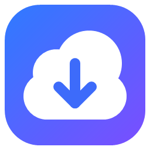
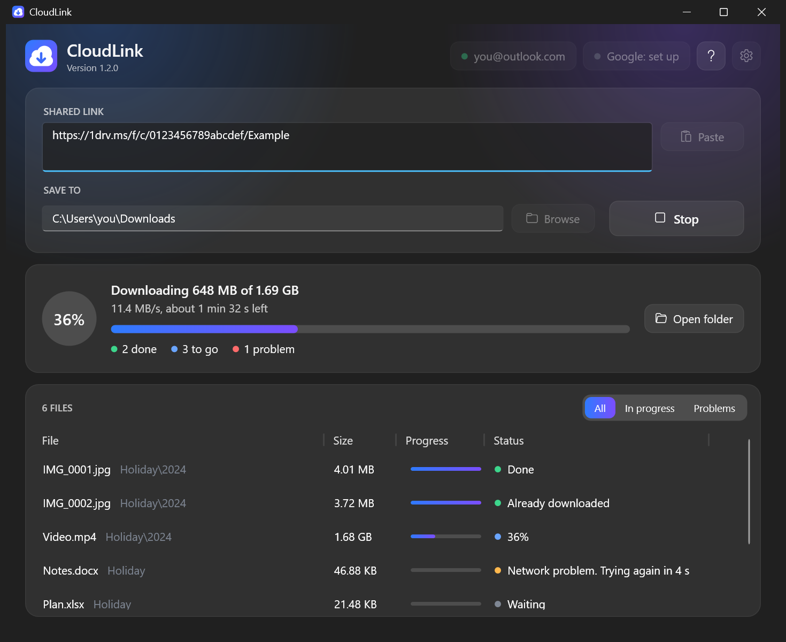
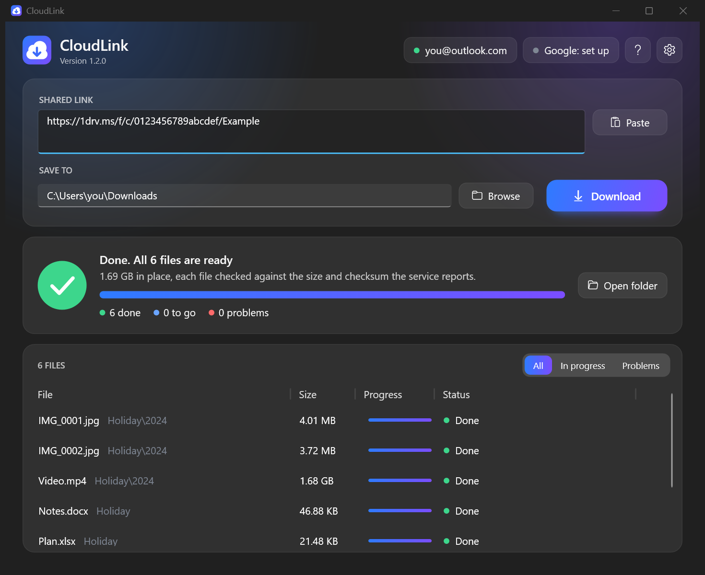
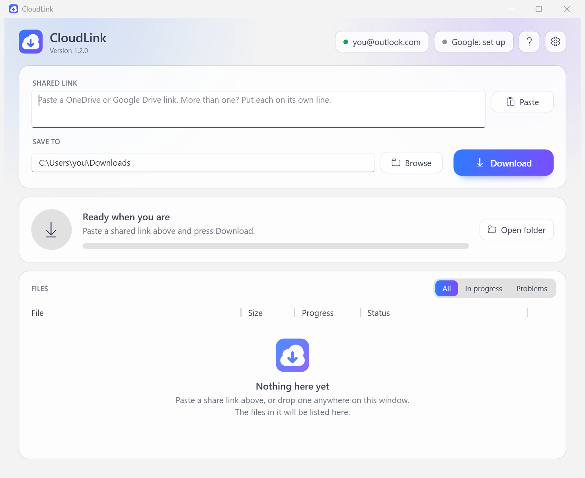

<p align="center">
  
</p>
<h1 align="center">CloudLink</h1>
<p align="center">
  Download shared OneDrive and Google Drive folders to your PC.<br>
  Paste the link, press <b>Download</b>, and get every file, checked and complete.
</p>

<p align="center">
  
</p>

## Why

Browsers are a poor way to fetch a large shared folder. OneDrive and Google Drive zip it first, the zip
fails or times out on big folders, and one dropped connection means starting over. CloudLink downloads the
files themselves, one by one, resumes whatever was interrupted, and verifies each file before calling it done.

## Features

| | |
|---|---|
| **Paste and go** | Paste one or more share links (or drop them on the window). A link on the clipboard is picked up automatically. |
| **Whole folders** | A shared folder is recreated on disk with all its subfolders. Single-file links work too. |
| **Resume** | Interrupted files continue from where they stopped, after a dropped connection, **Stop**, a restart of the program or a reboot. |
| **Verified** | Each file is checked against the size and checksum the service reports (SHA-256 or QuickXorHash on OneDrive, MD5 on Google Drive). A mismatch is downloaded again. |
| **Self-healing** | Network errors, stalls, throttling and server errors are retried with growing pauses. If the network disappears, CloudLink waits for it. Failed files get a second round at the end. |
| **Clear** | One progress bar for the whole job with speed and time left, a status for every file, and a filter that shows only what needs attention. |
| **Private links** | Links shared with the signed-in account can be downloaded, not only public ones (see [Limits](#limits)). |
| **Google documents** | Docs, Sheets and Slides are exported to `.docx`, `.xlsx` and `.pptx`. |
| **Light and dark** | Follows the Windows theme. Animations follow the Windows animation setting. |

## Getting started

1. Download `CloudLink.exe` from the [latest release](../../releases/latest), or [build it](#building). It is a
   single file; nothing needs installing. See
   [Verifying a download](docs/SIGNING.md) for the signature and checksum.
2. Run it and paste a share link.
3. Choose the folder to save to and press **Download**.

The first OneDrive download opens your browser for a Microsoft sign-in with the account you already have;
there is nothing to set up in Azure. Google Drive needs a one-time setup, which the
[user guide](docs/USER-GUIDE.md#google-drive) walks through step by step, with pictures. The same guide is
published at <https://amgcloud.io/apps/cloudlink/guide/>.

<p align="center">
  
  
</p>

## Supported links

| Service | Link forms |
|---|---|
| OneDrive (personal) | `1drv.ms/...`, `onedrive.live.com/...` |
| OneDrive for work or school, SharePoint | `*.sharepoint.com/...` |
| Google Drive | `drive.google.com/drive/folders/...`, `drive.google.com/file/d/...`, `open?id=`, `uc?id=` |
| Google Docs, Sheets, Slides | `docs.google.com/document/d/...` and the like |

## How it works

CloudLink uses the services' official APIs: the Microsoft Graph *shares* API and the Google Drive v3 API.
It signs in through your browser with OAuth (authorization code with PKCE), so it never sees a password.
There are no scraped web pages or undocumented endpoints to break when a site changes.

Each file is written as `name.part`, continued with HTTP range requests after any interruption, verified,
and only then renamed. A fresh download address is requested on every attempt, so nothing expires mid-run.
More detail is in [docs/ARCHITECTURE.md](docs/ARCHITECTURE.md).

## Documentation

- [User guide](docs/USER-GUIDE.md): downloading, accounts, the Google Drive setup step by step, troubleshooting
  (also at <https://amgcloud.io/apps/cloudlink/guide/>)
- [Verifying and signing](docs/SIGNING.md): the signature, checksums, and signing your own build
- [Microsoft Store](docs/STORE.md): building the Store package, the listing, and the submission step by step
- [Microsoft app registration](docs/APP-REGISTRATION.md): what users need (nothing), and what a fork needs
- [Architecture](docs/ARCHITECTURE.md): how the code is organised and why
- [Brand](docs/BRAND.md): logo, colours and interface principles
- [Security](SECURITY.md): what is stored, what is sent where, how to report a problem
- [Privacy statement](docs/PRIVACY.md) and [terms of use](docs/TERMS.md)
- [Changelog](CHANGELOG.md)

## Building

Requires Windows and the .NET 10 SDK.

```powershell
.\build.ps1
```

This runs the tests and writes a single self-contained `publish\CloudLink.exe` with a `SHA256SUMS.txt`, signed
with your code-signing certificate (`-CertThumbprint` to name one). Without a certificate the build stops
before building anything: use `.\build.ps1 -CreateSelfSignedCert` for a first self-signed build, or `-NoSign`
for an unsigned one. See [docs/SIGNING.md](docs/SIGNING.md).

The tests drive the real download engine and both providers against a local server that cuts connections,
stalls, throttles and corrupts data.

```powershell
.\build-msix.ps1
```

builds the package for the Microsoft Store instead (`publish-store\CloudLink_<version>.0_x64.msix`, unsigned:
the Store signs it). It needs `makeappx.exe` and `makepri.exe` from the Windows SDK, the package identity
from Partner Center in `store\identity.json`, and a committed working tree; `-DryRun` tries the build with a
made-up identity. See [docs/STORE.md](docs/STORE.md).

## Licence

[MIT](LICENSE). Copyright (c) 2026 AMG Cloud Engineering.

## Limits

- Windows 10 or 11, 64-bit.
- Google Forms, Sites and My Maps have no file content and are listed as skipped.
- A Google document larger than 10 MB can only be exported when signed in (an API key is not enough).
- Google Drive requires credentials that you create yourself; Google does not allow access without them.
- Work and school Microsoft accounts usually need an administrator to approve CloudLink once for the
  organisation; that is Microsoft's default for apps from a publisher it has not verified
  ([details](docs/APP-REGISTRATION.md#work-and-school-accounts)). Personal accounts do not.
- What has been tested: OneDrive sign-in and download with a personal Microsoft account, and Google Drive
  links that anyone can open, with an API key. Not tested: work and school Microsoft accounts; opening a link
  with the other kind of Microsoft account (a personal account on a `sharepoint.com` link or the reverse);
  and Google sign-in for private links, which so far is covered only by automated tests against a local
  stand-in server.
