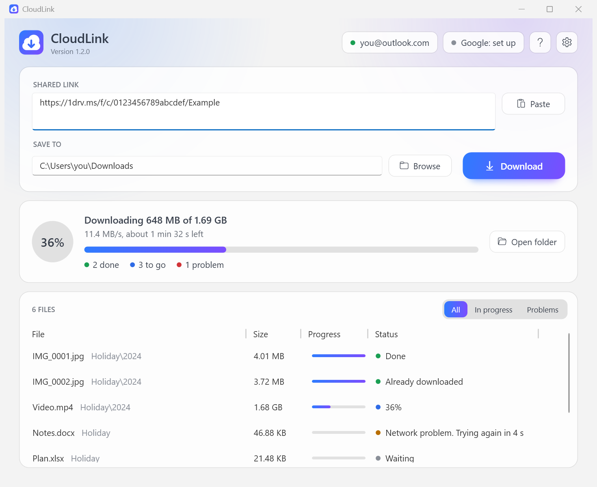

# CloudLink user guide

## The window

From top to bottom:

1. **Accounts, Help and Settings** (top right). A green dot means that account is signed in.
   Click an account to sign in or out. **?** or <kbd>F1</kbd> opens Help.
2. **Shared link** and **Save to**. What to download and where it goes. **Download** starts; while a
   download runs the same spot shows **Stop**.
3. **Status**. What is happening now: overall progress, speed, time left, and counts of files done,
   to go, and with problems.
4. **Files**. Every file with its own progress and status. **In progress** and **Problems** narrow
   the list.

## Downloading

1. Paste a share link. Several links go on separate lines. You can also drop a link on the window.
2. Check the **Save to** folder. A shared folder named *Holiday* is saved as `<Save to>\Holiday\...`.
3. Press **Download**.

CloudLink first looks through the link to find every file, then downloads four files at a time (changeable in
Settings).

### Stopping and continuing

Press **Stop** at any time. Finished files stay; unfinished ones are kept with a `.part` ending. Press
**Continue** (or **Download** with the same link and folder, even days later) and CloudLink carries on from
where it stopped. Files that are already complete are not downloaded again.

The same applies after a lost connection, sleep, a crash or a reboot.

### What the statuses mean

| Status | Meaning |
|---|---|
| Waiting | In the queue. |
| a percentage | Downloading now. |
| Checking | Downloaded; being compared with the service's checksum. |
| *reason*. Trying again in *n* s | Something went wrong and CloudLink is retrying on its own. |
| Waiting for the network to come back | The PC is offline. Nothing is lost; it continues when the network returns. |
| Done | Complete and verified. |
| Already downloaded | The file was there from an earlier run. |
| Skipped: *reason* | The item has no file content, for example a Google Form. |
| Failed: *reason* | CloudLink gave up after repeated attempts. Press **Try again**. |
| Stopped | You pressed **Stop** while it was downloading. |

## Accounts

### OneDrive and SharePoint

Press **Download** with a OneDrive link, or click **Microsoft: sign in**. Your browser opens; sign in with
the Microsoft account that can open the link. You do not need an Azure account, a tenant or anything else
from Microsoft beyond that account.

Use the kind of account that matches the link: a personal Microsoft account for links from a personal
OneDrive (`1drv.ms`, `onedrive.live.com`), a work or school account for links from an organisation
(`...sharepoint.com`). A personal-OneDrive link shared with *anyone* can be opened with any personal account.

Microsoft's permission page says the app can *edit* your files. Microsoft Graph only opens share links for
apps holding a read-write permission, so there is no way around asking for it. CloudLink only downloads: it
never uploads, changes or deletes files. (Opening a link records your account as having opened it, exactly as
opening it in a browser does.) The page also calls the app *unverified*, which is about a Microsoft business
programme and not about the program itself.

If the button reads **Microsoft: set up** instead, this copy of CloudLink was built without an application ID
and needs one entered in Settings; see [APP-REGISTRATION.md](APP-REGISTRATION.md#creating-a-registration).

**Work or school accounts.** By default, organisations do not let their people approve an app like this
themselves. If Microsoft's page says **Need admin approval**, an administrator has to approve CloudLink once
for the organisation; [APP-REGISTRATION.md](APP-REGISTRATION.md#work-and-school-accounts) has the link to send them
and the alternatives.

### Google Drive

Google does not let a program read Drive without credentials created by its user. This is a one-time setup
of about five minutes at <https://console.cloud.google.com>:

1. Create a project (any name).
2. Open **APIs & Services → Library**, find **Google Drive API**, press **Enable**.
3. Then choose one, or both:

   **For links anyone can open: an API key**
   - **APIs & Services → Credentials → Create credentials → API key**.
   - Copy the key into **Settings → API key**.

   **For private links: sign-in**
   - **APIs & Services → OAuth consent screen**: choose *External*, fill in the app name and your address,
     and add your own Google address under **Test users**.
   - **Credentials → Create credentials → OAuth client ID**, type **Desktop app**.
   - Copy the client ID and client secret into **Settings**, then click the Google button at the top right of
     the main window (it reads **Google: set up**, or **Google: public links only** when an API key is saved)
     to sign in.

While the consent screen is in *Testing*, Google ends the sign-in after seven days and CloudLink asks you to
sign in again. Publishing the consent screen removes that limit.

## Troubleshooting

| What you see | What to do |
|---|---|
| *Not found, or the link no longer works* | The link is incomplete, was withdrawn, or the signed-in account may not open it. Open it in a browser with the same account to check. |
| *Access denied* | Sign in with the account the item was shared with. |
| *Your organisation requires an administrator to approve CloudLink* / **Need admin approval** in the browser | Your work or school does not let you approve apps yourself. Close the page, press **Stop** in CloudLink if it is still waiting, and see [Work and school accounts](APP-REGISTRATION.md#work-and-school-accounts). |
| Microsoft's page shows an error instead of a sign-in form | The fault is in the app registration CloudLink signs in through, not in your account. Press **Stop**, and please [report it](https://github.com/lukasz-gratkowski/cloud-link/issues). Until it is fixed you can enter an application ID of your own in Settings; see [APP-REGISTRATION.md](APP-REGISTRATION.md#creating-a-registration). |
| *The Microsoft sign-in was not finished in time* | The browser page was closed or left open without finishing. Press **Download** to try again. If the page said **Need admin approval**, see the row above. |
| *The sign-in was cancelled, or the permission was not granted* | Press **Download** to try again and accept the permission page; CloudLink cannot work without it. |
| *The service asked to slow down* | Nothing; CloudLink waits and continues. If it happens a lot, lower **Files downloaded at the same time** in Settings. |
| *Not enough free space* | Choose another folder or free some space, then press **Download** again. |
| Sign-in page says the app is not verified (Google) | Expected for your own project in *Testing*. Choose **Advanced → Go to ...**. |
| A Google document fails with a size error | Documents over 10 MB can only be exported when signed in, not with an API key. |
| Windows says *Unknown publisher* when starting CloudLink | See [SIGNING.md](SIGNING.md). |
| Something else | **Help → Open log** shows what happened, with the service's own error text. |

## Where things are kept

`%LOCALAPPDATA%\CloudLink` holds:

- `settings.json`: your settings, including the address of each signed-in account and the last folder used.
  The Google API key and client secret in it are encrypted for your Windows account.
- `microsoft.token`, `google.token`: the sign-ins, encrypted for your Windows account.
- `cloudlink.log`: the log.

Deleting the folder resets CloudLink. Downloaded files are tagged as coming from the internet, the same way
browsers tag them, so Windows and Office apply their usual caution when you open them.
