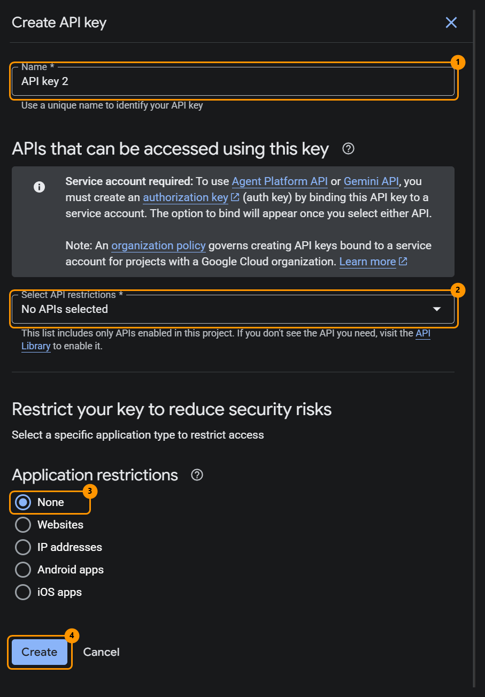
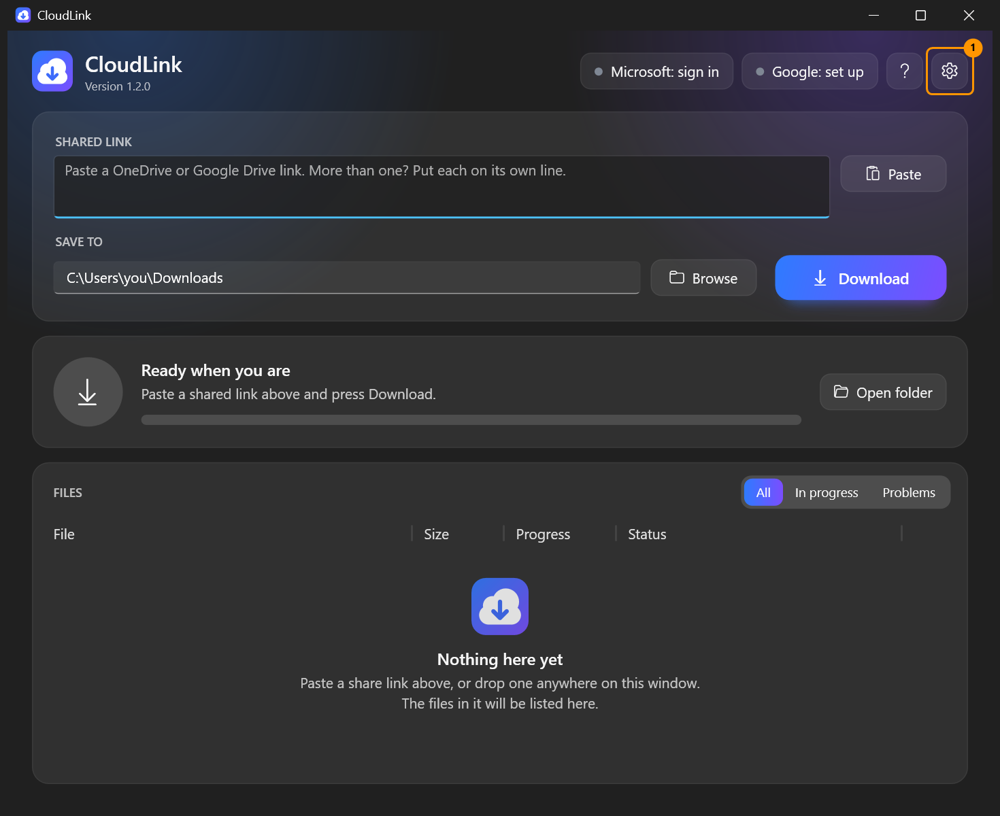
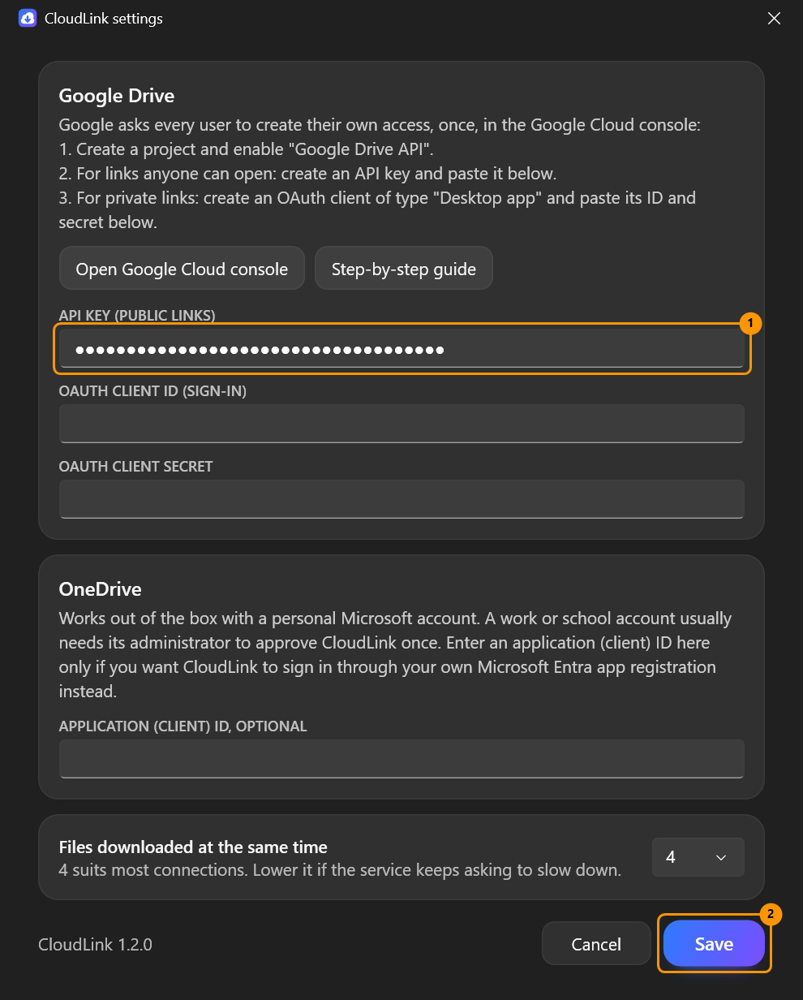
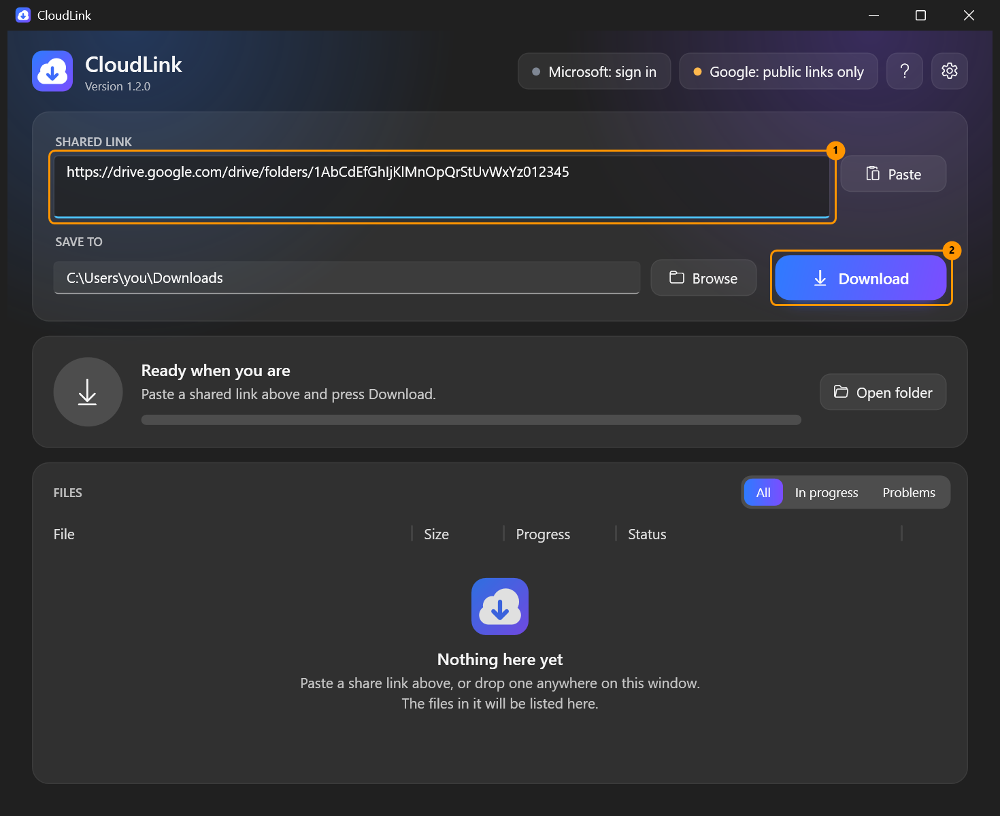
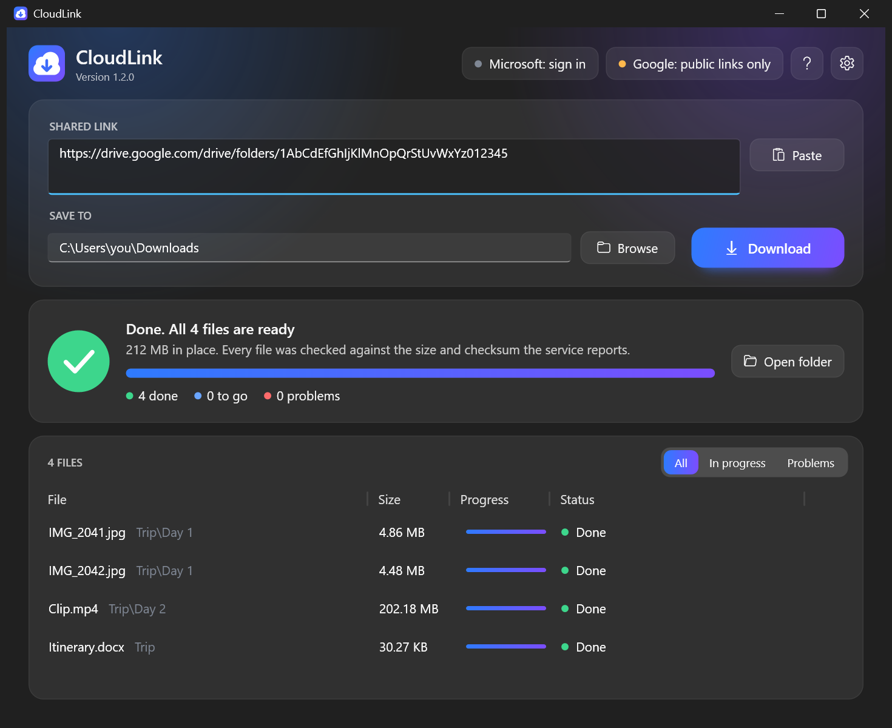
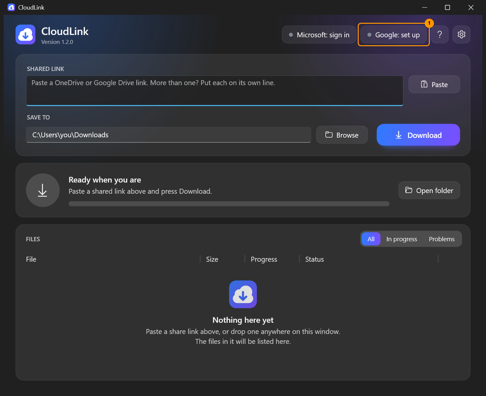
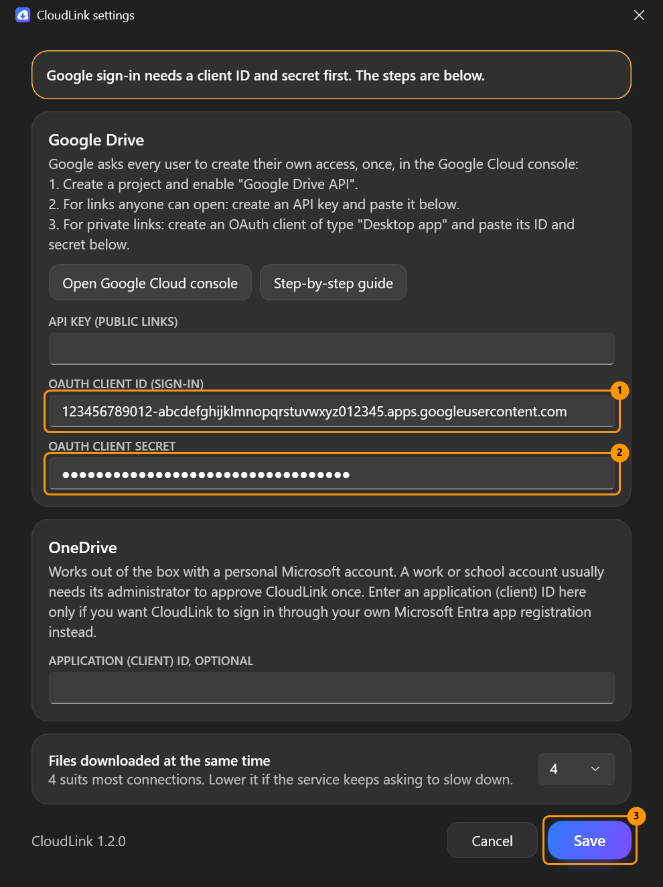
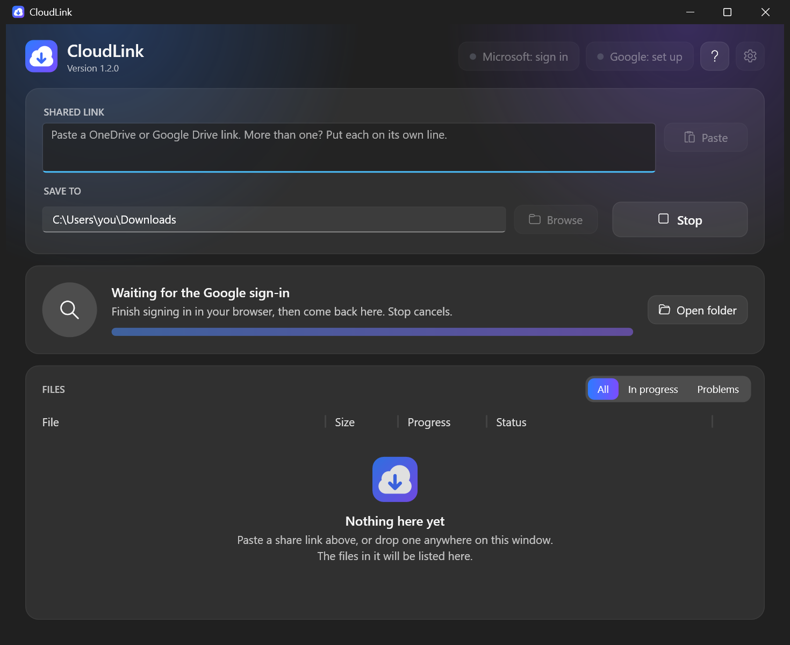
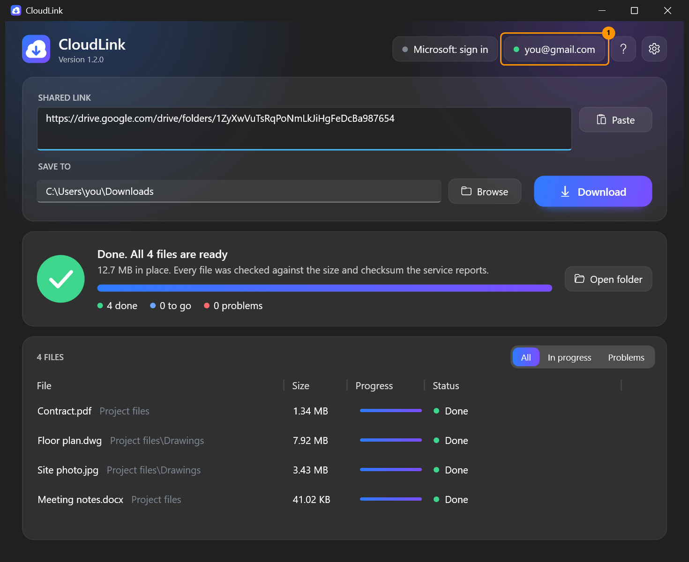

# CloudLink user guide

**Contents**

- [The window](#the-window)
- [Downloading](#downloading)
- [OneDrive and SharePoint](#onedrive-and-sharepoint)
- [Google Drive](#google-drive): the one-time setup, step by step
  - [Before you start: a project with the Drive API](#before-you-start-a-project-with-the-drive-api)
  - [Route A: an API key, for links anyone can open](#route-a-an-api-key-for-links-anyone-can-open)
  - [Route B: sign-in, for private links](#route-b-sign-in-for-private-links)
- [Checking your download](#checking-your-download)
- [Troubleshooting](#troubleshooting)
- [Where things are kept](#where-things-are-kept)

## The window


From top to bottom:

1. **Accounts, Help and Settings** (top right). A green dot means that account is signed in.
   Click an account to sign in or out. **?** or <kbd>F1</kbd> opens Help.
2. **Shared link** and **Save to**. What to download and where it goes. **Download** starts; while a
   download runs the same spot shows **Stop**.
3. **Status**. What is happening now: overall progress, speed, time left, and counts of files done,
   to go, and with problems.
4. **Files**. Every file with its own progress and status. **In progress** and **Problems** narrow
   the list.

## Downloading

1. Paste a share link. Several links go on separate lines. You can also drop a link on the window.
2. Check the **Save to** folder. A shared folder named *Holiday* is saved as `<Save to>\Holiday\...`.
3. Press **Download**.

CloudLink first looks through the link to find every file, then downloads four files at a time (changeable in
Settings).

### Stopping and continuing

Press **Stop** at any time. Finished files stay; unfinished ones are kept with a `.part` ending. Press
**Continue** (or **Download** with the same link and folder, even days later) and CloudLink carries on from
where it stopped. Files that are already complete are not downloaded again.

The same applies after a lost connection, sleep, a crash or a reboot.

### What the statuses mean

| Status | Meaning |
|---|---|
| Waiting | In the queue. |
| a percentage | Downloading now. |
| Checking | Downloaded; being compared with the service's checksum. |
| *reason*. Trying again in *n* s | Something went wrong and CloudLink is retrying on its own. |
| Waiting for the network to come back | The PC is offline. Nothing is lost; it continues when the network returns. |
| Done | Complete and verified. |
| Already downloaded | The file was there from an earlier run. |
| Skipped: *reason* | The item has no file content, for example a Google Form. |
| Failed: *reason* | CloudLink gave up after repeated attempts. Press **Try again**. |
| Stopped | You pressed **Stop** while it was downloading. |

## Accounts

### OneDrive and SharePoint

Press **Download** with a OneDrive link, or click **Microsoft: sign in**. Your browser opens; sign in with
the Microsoft account that can open the link. You do not need an Azure account, a tenant or anything else
from Microsoft beyond that account.

Use the kind of account that matches the link: a personal Microsoft account for links from a personal
OneDrive (`1drv.ms`, `onedrive.live.com`), a work or school account for links from an organisation
(`...sharepoint.com`). A personal-OneDrive link shared with *anyone* can be opened with any personal account.

Microsoft's permission page says the app can *edit* your files. Microsoft Graph only opens share links for
apps holding a read-write permission, so there is no way around asking for it. CloudLink only downloads: it
never uploads, changes or deletes files. (Opening a link records your account as having opened it, exactly as
opening it in a browser does.) The page also calls the app *unverified*, which is about a Microsoft business
programme and not about the program itself.

If the button reads **Microsoft: set up** instead, this copy of CloudLink was built without an application ID
and needs one entered in Settings; see [APP-REGISTRATION.md](APP-REGISTRATION.md#creating-a-registration).

**Work or school accounts.** By default, organisations do not let their people approve an app like this
themselves. If Microsoft's page says **Need admin approval**, an administrator has to approve CloudLink once
for the organisation; [APP-REGISTRATION.md](APP-REGISTRATION.md#work-and-school-accounts) has the link to send them
and the alternatives.

### Google Drive

CloudLink has no Google registration of its own, so before it can read Google Drive you create access for it
yourself in the Google Cloud console. You do this once. Using the Drive API this way is free of charge today,
and the whole setup takes ten to fifteen minutes.

There are two routes. Choose by the kind of link you want to download; you can set up both.

| You want to download | Route | What you create in the console |
|---|---|---|
| Links that anyone with the link can open | [A: an API key](#route-a-an-api-key-for-links-anyone-can-open) | An API key |
| Private links: files shared with your Google account, or your own | [B: sign-in](#route-b-sign-in-for-private-links), not yet tested against Google | A consent screen and a "Desktop app" client; you then sign in with your Google account |

Once you are signed in (route B), CloudLink uses the sign-in for every Google link and the key is no longer
used.

#### Before you start: a project with the Drive API

Both routes begin the same way. You need a Google account with 2-Step Verification switched on; Google asks
for it before it opens the Cloud console.

1. Open <https://console.cloud.google.com> and sign in. Accept Google's terms of service if it asks. You do
   not need the free trial, a billing account or a payment card for anything in this guide; if Google offers
   them, close the offer.
2. **Create a project.** Open the menu (☰) → **IAM & Admin** → **Create a Project**. Type a **Project name**,
   for example `CloudLink`, and press **Create**. When Google's notification says the project is created,
   open the project from that notification, or pick it in the project list at the top of the page. Go on only
   when its name is shown there.
3. **Switch on the Drive API.** Menu → **APIs & Services** → **Library**, find **Google Drive API**, open it
   and press **Enable**. This address goes straight there:
   <https://console.cloud.google.com/flows/enableapi?apiid=drive.googleapis.com>.

Google renames things from time to time. If a label here differs a little from what you see, pick the nearest
match.

#### Route A: an API key, for links anyone can open

An API key identifies your project to Google, not you. With it CloudLink can read only what is shared as
*Anyone with the link*. Do [Before you start](#before-you-start-a-project-with-the-drive-api) first.

1. In the Cloud console open the menu → **APIs & Services** → **Credentials**, then **Create credentials** →
   **API key**.
2. Fill in the panel as marked in the picture.

    

    - Mark **1**, **Name**: anything that tells you what the key is for, such as `CloudLink`.
    - Mark **2**, **Select API restrictions**: open the list and tick **Google Drive API**, and nothing else.
      The list shows only the APIs switched on in the project; if Google Drive API is missing, go back to
      step 3 of *Before you start*.
    - Mark **3**, **Application restrictions**: leave **None**. The other choices are for websites, phone apps
      and servers with a fixed address. With the first two Google refuses CloudLink's requests, and with the
      third it accepts them only from the addresses on the key's list.
    - Mark **4**: press **Create**.

    The note about a service account in that panel is about other Google services and does not apply here.
3. Google shows the new key. Copy it. Treat it like a password: do not post it or send it to anyone.
4. In CloudLink press the **Settings** button, the gear at the top right.

    
5. Paste the key into **API key (public links)** and press **Save**.

    

    The Google button at the top right now reads **Google: public links only**.
6. Paste the Google Drive link and press **Download**.

    

    CloudLink lists the files behind the link and downloads them.

    

A new key, or a change to its restrictions, can take up to five minutes to start working.

What a key cannot do:

- It opens only what is public. A private link ends with *Not found*; for those, use route B.
- Items inside a public folder that are not themselves open to anyone with the link can be left out of the
  list, so they are not downloaded.
- A Google document larger than 10 MB cannot be exported with a key, only when signed in.

If a key ever gets out, delete it on the **Credentials** page and create a new one.

#### Route B: sign-in, for private links

With this route you sign in to Google from CloudLink, and CloudLink can download whatever that Google account
can open. What you create in the console is called an *OAuth client*. It belongs to your project, and only
the accounts you list can sign in through it.

> These steps follow Google's current documentation and CloudLink's code, but CloudLink's Google sign-in has
> not yet been tried against Google itself. So far it has only passed automated tests against a local stand-in
> server, and the CloudLink pictures below show sample data. If a step does not match what you see, or the
> sign-in does not work, please [open an issue](https://github.com/lukasz-gratkowski/cloud-link/issues).

**In the Google Cloud console**, in the project from [Before you start](#before-you-start-a-project-with-the-drive-api):

1. Open the menu → **Google Auth platform**. On a new project it says that the platform is not configured yet;
   press **Get started**.
2. Fill in the four parts, pressing **Next** after each of the first three:
    - **App Information**: an **App name**, for example `My CloudLink` (Google does not accept names that
      imitate its own products), and your address as **User support email**.
    - **Audience**: **External**.
    - **Contact Information**: your e-mail address.
    - **Finish**: tick the agreement to Google's user data policy, press **Continue**, then **Create**.
3. **Add yourself as a test user.** Open **Audience** and, under **Test users**, press **Add users**. Enter the
   Google address you will sign in with, and any other that should be able to, and press **Save**. Google
   refuses every account that is not on this list.
4. **Say what the app may ask for.** Open **Data Access** → **Add or remove scopes**. Tick the row whose scope
   ends in `/auth/drive.readonly` (described as *See and download all your Google Drive files*), or paste
   `https://www.googleapis.com/auth/drive.readonly` under **Manually add scopes**. Press **Update**, then
   **Save**.
5. **Create the client.** Open **Clients** → **Create client**. For **Application type** choose **Desktop app**,
   type any **Name**, leave the box about an AI-powered agent unticked, and press **Create**.
6. **Copy the client ID and the client secret straight away**, from the dialog Google shows, or download the
   JSON file offered there; in that file they are the values of `client_id` and `client_secret` (open it with
   Notepad). Google shows the whole secret only this once. If you missed it, open the client on the
   **Clients** page, press **Add secret** and copy the new one. Treat the secret and the file like a password:
   do not post them, and leave them out of anything you attach to an issue.

The overview page may warn that the app is not verified or that there is no billing account. For your own use
those warnings can be left alone.

**In CloudLink:**

1. Click the Google button at the top right. It reads **Google: set up**, or **Google: public links only** if
   you have saved an API key.

    
2. Settings opens, because no client is saved yet. Paste the **OAuth client ID** and the
   **OAuth client secret**, and press **Save**.

    
3. Your browser opens on Google's pages, and CloudLink waits for you.

    

    In the browser:

    - Choose the Google account you added as a test user. If Google does not ask, it uses the account the
      browser is signed in with.
    - Google shows **Google hasn't verified this app**. That is expected: it is your own app, in testing.
      Press **Continue**.
    - Google asks whether the app may *see and download all your Google Drive files*. Press **Continue**
      (the button may read **Allow**).
    - The page says *Signed in*. Go back to CloudLink.
4. The Google button now shows your address and a green dot. Paste the private link and press **Download**.

    

If you opened Settings with the gear instead and saved the client there, nothing more happens by itself:
click the Google button to sign in.

**Every seven days.** These steps leave the app in Google's *Testing* state, and in that state Google ends a
sign-in seven days after you approved it. CloudLink shows nothing until the next download; then the browser
opens again and you sign in as in CloudLink step 3.

**In a Google Workspace organisation**, a project that belongs to the organisation can choose **Internal**
instead of **External** in console step 2. Only members of the organisation can then sign in, and no test users are
needed.

**If the browser shows an error instead of returning to CloudLink**, CloudLink cannot see it and keeps
waiting. Press **Stop**, put the cause right, and click the Google button again.

| Google says | Usual cause |
|---|---|
| Access blocked, error 403 `access_denied` | The account is not on the test users list (console step 3), or the browser used a different Google account. |
| Error 401 `invalid_client` or `deleted_client` | The client ID in Settings is not the one from the console, or the client was deleted there. Google also deletes a client by itself after six months without use; create a new one and paste the new ID and secret. |
| Error 400 `redirect_uri_mismatch` | The client was not created with the type **Desktop app**. |
| Error 400 `admin_policy_enforced` or `policy_enforced` | A work or school administrator, or Google's Advanced Protection Programme, does not allow it for this account. |

**Taking it away again.** In CloudLink, click the Google button and choose to sign out. To withdraw the
permission at Google, open <https://myaccount.google.com/linkedapps>. In the console you can delete the client
on the **Clients** page and the key on the **Credentials** page. Google itself deletes a client that has not
been used for six months.

## Checking your download

CloudLink's exe is signed, but with a self-signed certificate. Windows therefore shows *Windows protected your
PC* the first time you start it (choose **More info → Run anyway**) and lists the publisher as unknown. Your
browser may also ask you to confirm keeping the download. If Smart App Control is switched on in Windows 11,
it may block the program without offering **Run anyway**.

To confirm that the file is the one that was published, compare its checksum with the `SHA256SUMS.txt` of the
same [release on GitHub](https://github.com/lukasz-gratkowski/cloud-link/releases):

```powershell
Get-FileHash .\CloudLink.exe -Algorithm SHA256
```

The two must be the same. Capital and small letters make no difference: `Get-FileHash` prints capitals, the
file has small letters. [Verifying and signing](SIGNING.md) explains the signature as well.

## Troubleshooting

| What you see | What to do |
|---|---|
| *Not found, or the link no longer works* | The link is incomplete, was withdrawn, or the signed-in account may not open it. Open it in a browser with the same account to check. |
| *Not found* for a Google Drive link while the Google button reads **Google: public links only** | The link is private, and an API key opens only public ones. Click the Google button and sign in; see [route B](#route-b-sign-in-for-private-links). |
| *Access denied* | Sign in with the account the item was shared with. |
| *Access denied* for a Google Drive link when you use an API key | CloudLink puts *Access denied* in front of several different answers from Google, so read the rest of the line first. If it says the file is too large to be exported, see the row about Google documents below. If it mentions a rate limit and ends in *Trying again in n s*, CloudLink is retrying by itself and there is nothing to do. Otherwise the key is probably not allowed to call the Drive API: check that its API restriction is **Google Drive API**, that **Application restrictions** is **None**, and that the Drive API is switched on in the project; then allow five minutes. See [route A](#route-a-an-api-key-for-links-anyone-can-open). |
| *API key not valid* | The key was mistyped, or deleted in the console. Copy it again into Settings. |
| *Your organisation requires an administrator to approve CloudLink* / **Need admin approval** in the browser | Your work or school does not let you approve apps yourself. Close the page, press **Stop** in CloudLink if it is still waiting, and see [Work and school accounts](APP-REGISTRATION.md#work-and-school-accounts). |
| Microsoft's page shows an error instead of a sign-in form | The fault is in the app registration CloudLink signs in through, not in your account. Press **Stop**, and please [report it](https://github.com/lukasz-gratkowski/cloud-link/issues). Until it is fixed you can enter an application ID of your own in Settings; see [APP-REGISTRATION.md](APP-REGISTRATION.md#creating-a-registration). |
| *Waiting for the Google sign-in* does not end | Google is showing an error in the browser; the table under [route B](#route-b-sign-in-for-private-links) lists the usual ones. Press **Stop**, put it right and click the Google button again. |
| *Sign-in did not work* just after the browser said *Signed in* (Google) | The client secret in Settings is wrong. Copy it again, or add a new secret in the console and paste that. |
| After signing in, the browser says the page at `127.0.0.1` cannot be reached | The sign-in was finished after CloudLink had stopped waiting (you pressed **Stop**, or ten minutes passed). Click the Google button and sign in again. |
| *The Microsoft sign-in was not finished in time* or *The Google sign-in was not finished in time* | The browser page was closed, or left open for more than ten minutes without finishing. Click the Microsoft or Google button at the top right to sign in again. If Microsoft's page said **Need admin approval**, see the row about that message further up. |
| *The Microsoft sign-in was cancelled, or the permission was not granted* (or the same with *Google*) | Click the Microsoft or Google button at the top right to sign in again, and accept the permission page; CloudLink cannot work without it. |
| *The service asked to slow down*, or for Google Drive *Access denied* with a mention of a rate limit, followed by *Trying again in n s* | Nothing; CloudLink waits and continues. If it happens a lot, lower **Files downloaded at the same time** in Settings. |
| *Not enough free space* | Choose another folder or free some space, then press **Download** again. |
| **Google hasn't verified this app** in the browser | Expected for your own project in *Testing*. Press **Continue**. |
| The browser opens for a Google sign-in although you were signed in | In Google's *Testing* state a sign-in lasts seven days. Sign in again. |
| A Google document fails, saying it is *too large to be exported* | Documents over 10 MB can only be exported when signed in, not with an API key. |
| Windows says *Unknown publisher* when starting CloudLink | See [Checking your download](#checking-your-download). |
| Windows blocks CloudLink and does not offer **Run anyway** | Smart App Control is switched on in Windows 11. See [Checking your download](#checking-your-download). |
| Something else | **Help → Open log** shows what happened, with the service's own error text. |

## Where things are kept

`%LOCALAPPDATA%\CloudLink` holds:

- `settings.json`: your settings, including the address of each signed-in account and the last folder used.
  The Google API key and client secret in it are encrypted for your Windows account.
- `microsoft.token`, `google.token`: the sign-ins, encrypted for your Windows account.
- `cloudlink.log`: the log.

Deleting the folder resets CloudLink. Downloaded files are tagged as coming from the internet, the same way
browsers tag them, so Windows and Office apply their usual caution when you open them.
